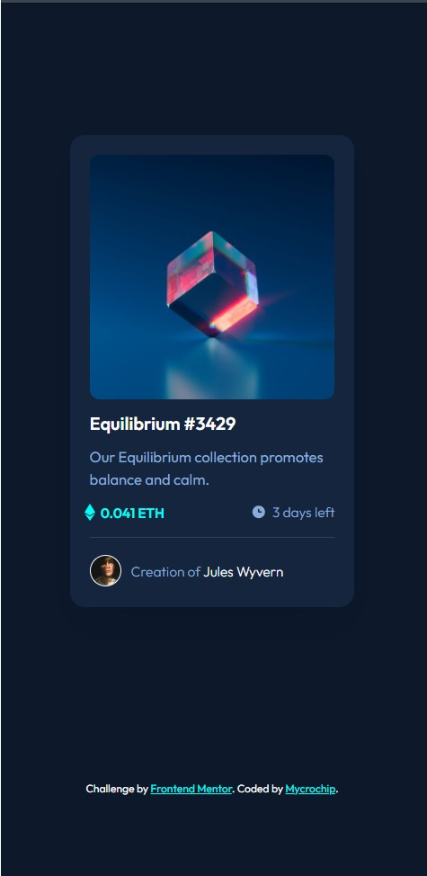

# Frontend Mentor - NFT preview card component solution

This is a solution to the [NFT preview card component challenge on Frontend Mentor](https://www.frontendmentor.io/challenges/nft-preview-card-component-SbdUL_w0U). Frontend Mentor challenges help you improve your coding skills by building realistic projects. 

## Table of contents

- [Overview](#overview)
  - [The challenge](#the-challenge)
  - [Screenshot](#screenshot)
  - [Links](#links)
- [My process](#my-process)
  - [Built with](#built-with)
  - [What I learned](#what-i-learned)
  - [Continued development](#continued-development)
  - [Useful resources](#useful-resources)
- [Author](#author)
- [Acknowledgments](#acknowledgments)


## Overview

### The challenge

Users should be able to:

- View the optimal layout depending on their device's screen size
- See hover states for interactive elements

### Screenshot




### Links

- Solution URL: [Add solution URL here](https://your-solution-url.com)
- Live Site URL: [https://mycrochip.github.io/nft-preview-card/](https://mycrochip.github.io/nft-preview-card/)


## My process

### Built with

- Semantic HTML5 markup
- CSS custom properties
- Flexbox

### What I learned

I gained some understanding abput the use of flex-box. Though, in this project, I only used for spacing.
I also practiced the used of varibles in css (They were not necessary, but I wanted to apply best practices)

I was particularly proud of myself that I cracked the positioning of items 'absolutely' and got to center them through muscle memory
(spent alot of time trying to figure that out)

```html
<div class="container">
    
    
</div>
```
```css
.overlay {
    /*center the overlay*/
  inset: 0;
  margin: auto;
}
```

### Continued development

I quickly took on this challenge after completing [this](https://github.com/mycrochip/QR-Code-Component) challenge.
The added challenge was setting the hover states for the image and some texts. I learned hoe to reuse code here.


## Author

- Frontend Mentor - [@mycrochip](https://www.frontendmentor.io/profile/mycrochip)
- Twitter - [@mycrochip_world](https://www.twitter.com/mycrochip_world)
